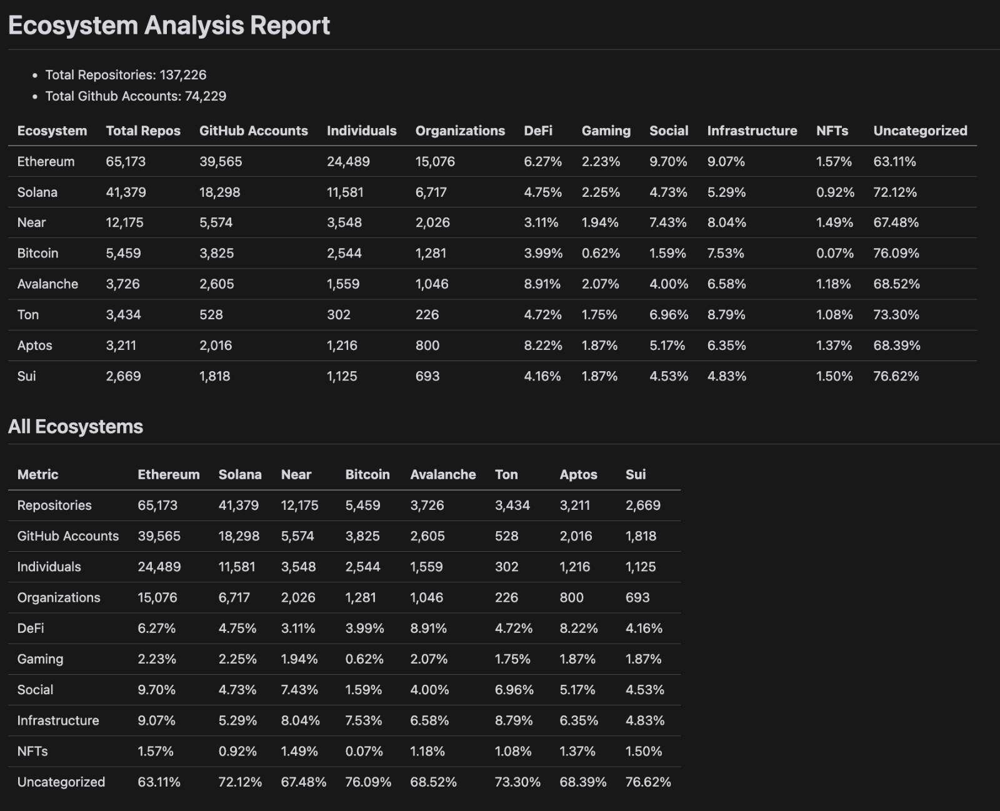

# Ecosystem Analysis Tools

[](https://opensource.org/licenses/MIT)

A suite of Python scripts for analyzing, categorizing, and organizing TOML files from Electric Capital's [crypto-ecosystems](https://github.com/electric-capital/crypto-ecosystems) directory.

**Important Note:** The categorization defined in `constants.py` requires improvement. Currently, the filtering mechanism is not robust, which leads to imprecise category results in the generated reports. Users should interpret the category-specific data with caution until this issue is remedied.

## Features

### 1. stats.py

Generates detailed statistics from individual TOML repository files.

**Key features:**
- Comprehensive report generation including:
  - Overview (total repositories, valid/missing repositories, unique GitHub accounts)
  - Ecosystem Analysis (estimated repositories per category)
  - Account Analysis (repositories by accounts with > 5 contributions)
  - Category Analysis (detailed breakdown per category)
- Output: `<input_filename>-stats-<date>.txt`

### 2. organize.py

Processes TOML files to create standardized **# Repository** sections.

**Key features:**
- GitHub repository URL extraction and normalization
- URL deduplication and case-insensitive sorting
- Electric Capital TOML structure formatting
- Output: `<input>-organized-<date>.toml`

**Usage:**
```bash
python3 organize/organize.py <file-name>
```

### 3. report.py

Generates a comprehensive report from all TOML files in the `input` directory.

**Key features:**
- Overall ecosystem summary (total repositories, unique GitHub accounts)
- Per-ecosystem summary table (repositories, GitHub accounts, category breakdown)
- Comparative table for all ecosystems
- Repository categorization (DeFi, Gaming, Social, Infrastructure, NFTs, Uncategorized)
- Output: `report-<date>.md`

**Sample Output:**



## Usage

1. Place TOML files in the `input` directory.

2. Run the desired script:

   ```bash
   # Generate statistics for a specific file
   python3 scripts/stats.py <filename>

   # Organize TOML files
   python3 scripts/organize.py

   # Generate a master report
   python3 -m report.main
   ```

## Customization

Modify the `categories` dictionary in each script to customize category definitions and regex patterns for your analysis needs.

## Acknowledgments

- [Electric Capital](https://github.com/electric-capital/crypto-ecosystems) for the crypto-ecosystems data.
- Future contributors to this project.

## License

This project is licensed under the MIT License - see the [LICENSE](LICENSE) file for details.
